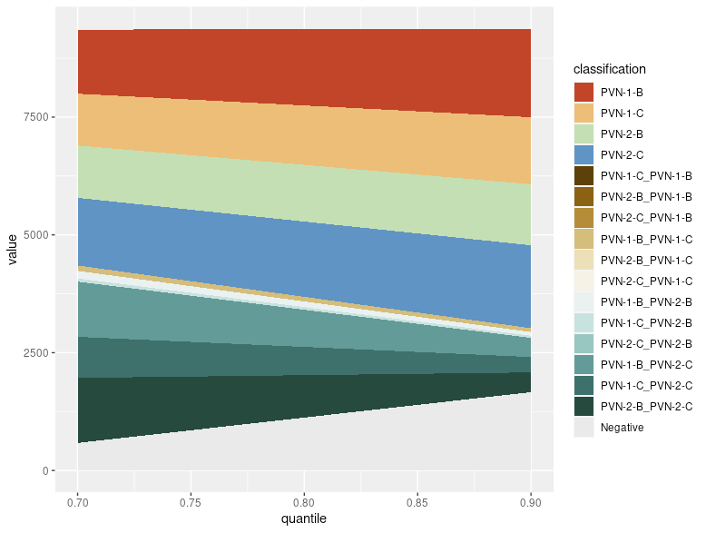
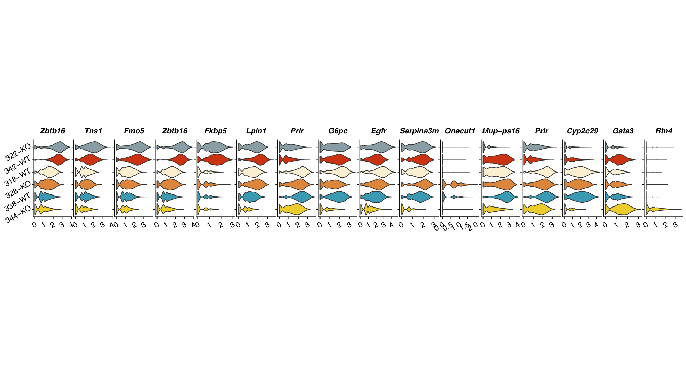
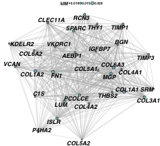

<!-- README.md is generated from README.Rmd. Please edit that file -->

```{r, include = FALSE}
knitr::opts_chunk$set(
  collapse = TRUE,
  comment = "#>",
  fig.path = "man/figures/README-",
  out.width = "100%"
)
```

# SCOPfunctions

<!-- badges: start -->
<!-- badges: end -->

An R package of functions for single cell -omics analysis. Fits into Seurat workflow.

## Install

### Install using devtools:

```
devtools::install_github("CBMR-Single-Cell-Omics-Platform/SCOPfunctions")
```

### install manually

```
git clone https://www.github.com/CBMR-Single-Cell-Omics-Platform/SCOPfunctions.git 
```

then from R:

```
install.packages("./SCOPfunctions", type="source", repos=NULL)
```

## Usage


```
library("SCOPfunctions")
library("Seurat")
```

Download the example data used in the Seurat hashing vignette at https://satijalab.org/seurat/archive/v3.1/hashing_vignette.html

Follow the initial steps of the hashing vignette up till and including the HTO normalization 

### Preprocess

Generate an area plot showing how proportions of singlets, doublets and negatives vary with the positive quantile

```
p_quantile = SCOPfunctions::prep_HTO_q_area_plot(
  seurat_obj=pbmc.hashtag,
  vec_range_quantile=seq(0.8,0.99,0.01),
  n_cores_max=Inf
) 
```


infer intra-hash doublets

```
# First demultiplex hashtags 
q = 0.98
pbmc.hashtag = Seurat::HTOdemux(pbmc.hashtag,assay = "HTO", positive.quantile = q)

# use inter-hash doublets to infer intra-hash doublets
pbmc.hashtag = SCOPfunctions::prep_intrahash_doub(
  seurat_obj=pbmc.hashtag,
  assay = "RNA",
  npcs=20,
  randomSeed = 12345
) 
```

Do QC on RNA assay 

```
pbmc.hashtag  = prep_qc_rna(
  seurat_obj=pbmc.hashtag,
  assay = "RNA"
  )
```

### Differential expression 

```

# first find clusters (after normalizing the RNA, finding variable features and scaling the data - not shown)
pbmc.hashtag <- FindNeighbors(pbmc.hashtag, reduction = "pca", dims = 1:20)
pbmc.hashtag <- FindClusters(pbmc.hashtag, resolution = 10, verbose = FALSE)

# find DE genes for cluster 0
df_DE = SCOPfunctions::DE_MAST_RE_seurat(
  object=pbmc.hashtag,
  random_effect.vars="hash.ID",
  test.use = "MAST",
  ident.1 = "0",
  group.by = "seurat_clusters"
)
```

find the activity values for a geneset 

```

# as an example, just use the top DE genes for cluster 0
vec_geneWeights <- seq(from = 1, to = 0.1, by = -0.1)
vec_geneWeights <- vec_geneWeights/sum(vec_geneWeights)

names(vec_geneWeights) =  head(rownames(df_DE), 10)

pbmc.hashtag$my_geneset_embeddings <- geneset_embed(
  mat_datExpr = as.matrix(GetAssayData(pbmc.hashtag, slot="scale.data", assay="SCT")),
  vec_geneWeights=vec_geneWeights,
  min_feats_present = 5)

```

find the activity values for a list of genesets

```

pbmc.hashtag <- geneset_embed_list_seurat(
  seurat_obj = pbmc.hashtag,
  list_vec_geneWeights=list_vec_geneWeights,
  slot="scale.data",
  assay="SCT",
  min_feats_present = 5,
  n_cores_max = Inf)

```

### Plot results

plot the distribution of cell clusters in different samples

```
plot_barIdentGroup(seurat_obj=pbmc.hashtag,
                    var_ident="sample_ID",
                    var_group="cluster",
                    vec_group_colors=NULL,
                    f_color=colorRampPalette(brewer.pal(n=11, name="RdYlBu")),
                    do_plot = F)
```


plot a cluster * feature grid of gene expression violin plots

```
# Here we just use the top variable genes, but normally we would use cluster marker genes
plot_vlnGrid(seurat_obj,
              slot="data",
              var_group="cluster",
              vec_features=head(VariableFeatures(seurat_obj),n=15),
              vec_group_colors=NULL,
              f_color = colorRampPalette(brewer.pal(n=11, name="RdYlBu")))
```



make a network plot of a set of co-expressed features

```
SCOPfunctions::plot_network(
  mat_datExpr=as.matrix(GetAssayData(seurat_obj, slot="data")),
  vec_geneImportance=vec_geneImportance,
  vec_genes_highlight=c(),
  n_max_genes=50,
  igraph_algorithm = "drl",
  fontface_labels="bold.italic",
  color_edge = "grey70",
  edge_thickness = 1)
```



## Contribute 

Issues and pull requests are welcome!
All contributions should be in line with the [usethis code of conduct](https://usethis.r-lib.org/CODE_OF_CONDUCT.html).
This package uses the methods and R tools set out in [R packages](https://r-pkgs.org/intro.html). 
All Pull Requests should follow the [tidyverse style guide](https://style.tidyverse.org/documentation.html). 
